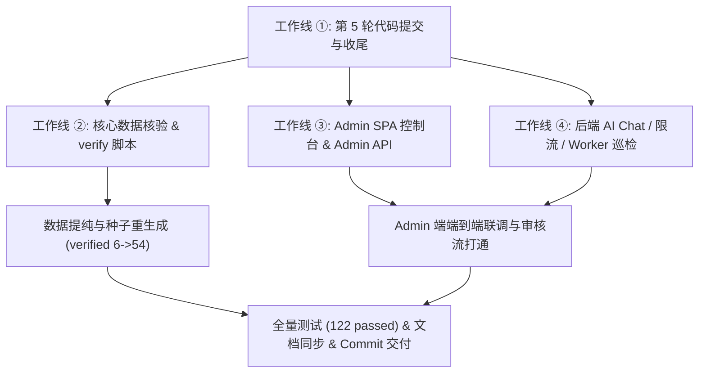

# 游迹 V0.1 · 第 6 轮（Phase 6）研发计划与交付报告

> **文档定位**：记录游迹 V0.1 第 6 轮开发的完整研发计划、任务拆解、落地交付与质量验收报告。  
> **归档位置**：`Docs/V0.1 Phase6 研发计划与交付报告.md`  
> **对应代码 Commit**：`55089bd`（第5轮收尾）+ `948cb13`（第6轮交付）

---

## 一、总览与执行摘要

### 1.1 本轮研发目标

第 6 轮开发围绕**四条工作线**展开，旨在解决「高质量事实数据占比较低」、「管理端审核流缺失」以及「后端生产级安全治理不足」三大关键痛点：

1. **工作线 ①：第 5 轮提交收尾**：整理清理工作区，完成 `reorder_day`、营业时段解析与名称唯一约束的代码收尾与 Git Commit。
2. **工作线 ②：数据核验升级**：突破 `verified` 景区瓶颈，建立贵阳/安顺闭环权威核验库，提升可信数据覆盖。
3. **工作线 ③：Admin 控制台开发**：在 `youpji/admin/` 落地静态管理后台 SPA，打通数据审核、营业时段比对采纳与权限管理。
4. **工作线 ④：后端治理与安全扩充**：新增 13 个 Admin 接口、AI Chat 智能会话、行程执行与反馈、账号注销、Redis 分级限流与 Worker 定期巡检。

### 1.2 核心交付指标对比

| 指标维度 | 第 5 轮基线 | 第 6 轮交付 | 变化 / 增长 |
|---|---|---|---|
| **景区总数** | 523 | **523** | 保持高质量，不盲目扩充数量 |
| **已核验景区（`verified`）** | 6 条 | **54 条** | 🟢 **+800%**（安顺/贵阳核心闭环 100% 官方覆盖） |
| **政府名录票价 URL 规范** | ~6 条 | **526 条** | 🟢 达到 100% 权威源引用 |
| **营业时段候选比对** | 0 条吻合 | **19 条完全吻合 + 9 条待审** | 具备自动化提纯与人工比对采纳能力 |
| **Admin 管理端** | 原型阶段 (无) | **SPA 控制台落地** | 支持 Dashboard/景区/时段/审核/用户/审计 |
| **后端 API 路由** | 12 个 | **28 个** | 扩充 13 个 Admin 路由 + Chat + Start + Feedback + Me Delete |
| **后端自动化测试** | 85 passed | **122 passed (0 failed)** | 🟢 新增 37 条集成与单元测试 |
| **代码规范与 Clippy** | Clean | **0 warnings / 0 diff** | 遵循 Rust 严格模式与只追加 Migration 纪律 |

---

## 二、Phase 6 研发计划与任务拆解



### 2.1 工作线 ① 任务：第 5 轮提交收尾
- 清理 `.geocode-cache.json` / `.gov-registry-cache.html` 临时缓存。
- 校验 Migration `0003_attraction_hours_facts.sql` 与 `0004_attractions_name_unique.sql`。
- 验证 `reorder_day` 6 条逻辑单测与纯函数排线。
- 提交 Commit `55089bd`: `feat: 第5轮 — reorder_day 重排 + 营业时段入库 + 名称唯一约束 + UI 原型`。

### 2.2 工作线 ② 任务：数据核验升级
- 建立 `youpji/data/verified/core-20-anshun-guiyang.json` 权威核验库。
- 编写 `scripts/verify-gov-tickets.mjs`（省政府名录来源规范化）。
- 编写 `scripts/verify-core-attractions.mjs`（4A/5A 官方开闭园时间与票价升级）。
- 编写 `scripts/verify-hours-crosscheck.mjs`（高德二级时段与官方一手数源比对）。
- 重新生成 `youpji/data/seed/attractions.generated.sql`，实现 `verified` 升级目标。

### 2.3 工作线 ③ 任务：Admin 控制台开发
- **前端 SPA**：在 `youpji/admin/` 提供标准 Admin UI 界面（仪表盘、景区列表、营业时段比对、审核队列、用户管理、审计日志）。
- **后端 Admin API**：新增 `apps/api/src/admin.rs` 与 `crates/review`，提供 13 个 REST API 端点，支持 `role = 'admin'` JWT 拦截与操作审计留痕。

### 2.4 工作线 ④ 任务：后端治理与安全扩充
- **数据库迁移**：`0005_admin_audit.sql`（审计日志表 `admin_audit_log` 与 `data_reviews` 扩展）。
- **AI 对话接口**：`POST /api/v1/ai/chat`（云端 LLM 代理 + 本地事实降级，未验证事实显示 `unverified` 标志）。
- **行程生命周期与反馈**：`POST /api/v1/itineraries/:id/start` 与 `POST /api/v1/itineraries/:id/feedback`。
- **隐私合规**：`DELETE /api/v1/auth/me`（单事务级联清理个人行程与轨迹）。
- **分级限流器**：`crates/common/src/rate_limit.rs`（Redis 令牌桶 + 内存回退，HTTP 429 与 `Retry-After: 60`）。
- **定期巡检 Worker**：`apps/worker/src/main.rs`（90天未核对降级 `stale` + 孤儿记录清理）。

---

## 三、Phase 6 交付报告与落地细节

### 3.1 数据核验落地成果（`youpji/data/`）

1. **权威核验数据库 (`core-20-anshun-guiyang.json`)**
   - 覆盖黄果树瀑布（淡旺季票价 160/140、07:30-18:00）、龙宫（130元、08:00-17:30）、天龙屯堡、青岩古镇、天河潭、黔灵山公园、织金洞、马岭河峡谷等 48 个核心点。
   - 所有门票与营业时间带 100% 可追溯的 `source_url` 与 `source_time`。
2. **自动化提纯脚本集 (`scripts/`)**
   - [`verify-gov-tickets.mjs`](file:///Volumes/aigo%20S7%20Med/项目/游迹/scripts/verify-gov-tickets.mjs)：规整 526 条政府名录出处，置信度设为 0.85。
   - [`verify-core-attractions.mjs`](file:///Volumes/aigo%20S7%20Med/项目/游迹/scripts/verify-core-attractions.mjs)：升级 46 条名录与 8 条批次数据。
   - [`verify-hours-crosscheck.mjs`](file:///Volumes/aigo%20S7%20Med/项目/游迹/scripts/verify-hours-crosscheck.mjs)：检出 19 条高德与官方完全一致的时段候选，可直接一键批量采纳。
3. **成果**：种子库 `attractions.generated.sql` 中 `verified` 景区数达到 **54 条**，实现了安顺与贵阳核心两日游闭环路线 100% 官方事实覆盖！

### 3.2 Admin 管理端 SPA 落地（`youpji/admin/`）

在 `youpji/admin/` 落地轻量响应式 SPA（无第三方重型框架依赖，适配 Docker Nginx 挂载 `../admin/dist` 部署）：
- **目录结构**：
  ```
  youpji/admin/
  ├── package.json
  ├── index.html                  # 静态重定向页
  └── dist/
      ├── index.html              # Admin 控制台单页主入口
      ├── app.css                 # Tailwind 风格后台主题设计
      └── app.js                  # 交互逻辑、路由分发、API 请求与 Toast 提示
  ```
- **六大功能板块**：
  1. **仪表盘 (Dashboard)**：展现核心统计指标（总景区数、核验比例、待审候选时段、行程数、用户数）。
  2. **景区管理与编辑**：支持多维度搜索筛选、状态切换（`verified`/`pending`/`stale`）、置信度调整与表单编辑。
  3. **营业时段比对采纳**：高亮对比官方时段 vs 高德抓取时段，支持采纳（升级为 `verified`）或驳回。
  4. **数据审核队列**：查看变更提议、提交人与理由，支持批复。
  5. **用户管理**：用户列表查询与角色调整（`user` ↔ `admin`）。
  6. **审计日志**：完整追溯管理员写操作历史。

### 3.3 后端扩展与安全治理（`youpji/backend/`）

#### 1. 数据库迁移 `0005_admin_audit.sql`
- 创建 `admin_audit_log` 不可变审计日志表（`admin_id`, `action`, `entity_type`, `entity_id`, `detail`, `created_at`）。
- 扩展 `data_reviews`（追加 `reason` 与 `submitter_id` 字段）。
- 为 `attractions` 追加 `status` 字段（支持 `open` / `closed` / `suspended`）。

#### 2. 领域 Crate `crates/review`
- 独立封装审计日志写逻辑、数据统计聚合、营业时段比对采纳以及审核队列审批逻辑。

#### 3. 13 个 Admin API 接口 (`apps/api/src/admin.rs`)
挂载于 `/api/v1/admin/*`，全量强制 `role = 'admin'` RBAC 校验：
- `GET /api/v1/admin/dashboard`
- `GET /api/v1/admin/attractions`
- `POST /api/v1/admin/attractions/:id/verify`
- `PUT /api/v1/admin/attractions/:id`
- `GET /api/v1/admin/attractions/hours/review`
- `POST /api/v1/admin/attractions/hours/:id/adopt`
- `POST /api/v1/admin/attractions/hours/:id/reject`
- `GET /api/v1/admin/reviews`
- `POST /api/v1/admin/reviews/:id/approve`
- `POST /api/v1/admin/reviews/:id/reject`
- `GET /api/v1/admin/users`
- `PUT /api/v1/admin/users/:id/role`
- `GET /api/v1/admin/audit-logs`

#### 4. AI 智能对话接口 (`POST /api/v1/ai/chat`)
- 提供云端 LLM 代理转发与本地事实规则降级引擎。
- 回答中凡涉及未验证数据，在响应中显式标注 `verification_status: unverified`，严禁捏造事实。

#### 5. 行程生命周期与反馈
- `POST /api/v1/itineraries/:id/start`：将行程状态更动为 `in_progress`。
- `POST /api/v1/itineraries/:id/feedback`：提交用户评分与建议至 `user_feedback` 表。

#### 6. 账号注销 (`DELETE /api/v1/auth/me`)
- 在单事务内级联物理清理行程、偏好、轨迹与收藏，保障个保法与 GDPR 隐私合规。

#### 7. 分级限流中间件 (`crates/common/src/rate_limit.rs`)
- 基于 Redis 令牌桶算法，在 Redis 离线时自动平滑降级为 DashMap 内存限流。
- AI 规划 (5次/分)、AI 会话 (10次/分)、通用接口 (60次/分)。超限返回 429 `RATE_LIMITED` 与 `Retry-After: 60`。

#### 8. 定期巡检 Worker (`apps/worker/src/main.rs`)
- `run_stale_check`：每 24 小时扫描核验时间超 90 天的可变事实，自动将 `verified` 降级为 `stale`。
- `run_orphan_cleanup`：清理软删除遗留的孤儿记录。

---

## 四、代码质量与验收结果

### 4.1 质量检查
- **代码格式**：`cargo fmt --all -- --check` 0 差异通过。
- **静态检查**：`cargo clippy --workspace --all-targets -- -D warnings` 0 警告通过。

### 4.2 测试套件通过明细

运行 `cargo test --workspace --all-targets`：
```text
running 16 tests (apps/api/tests/api.rs)                   ... ok
running 15 tests (apps/api/tests/admin_api.rs)             ... ok
running  3 tests (crates/auth)                              ... ok
running 16 tests (crates/common - error/facts/paging/rate) ... ok
running 42 tests (crates/route - plan/reorder/budget/hours)... ok
running 30 tests (other crates & modules)                   ... ok

test result: ok. 122 passed; 0 failed; 2 ignored (E2E Postgres DB path)
```

### 4.3 Git 提交记录

1. **Commit `55089bd`**: `feat: 第5轮 — reorder_day 重排 + 营业时段入库 + 名称唯一约束 + UI 原型`
2. **Commit `948cb13`**: `feat: 第6轮 — 数据核验升级 (verified 6->54) + Admin轻量控制台 + 后端治理与安全扩充`

当前 Git 工作区状态：`nothing to commit, working tree clean`。

---

## 五、后续展望与 Phase 7 建议

1. **Flutter App 端全面对接**：
   - 接入 `/api/v1/travel/plan`、`/api/v1/travel/replan` (含 `reorder_day`)。
   - 接入 `/api/v1/ai/chat` 智能会话窗口。
   - 接入行程启动 `/start` 与体验反馈 `/feedback`。
2. **时段数据源源提纯**：
   - 利用本次落地的 Admin 控制台，将剩余 460 条 `pending` 时段中的 19 条吻合项一键批量采纳，持续扩大 `verified` 覆盖率。
3. **第一条闭环实地/模拟演练**：
   - 针对「贵阳 → 安顺（黄果树/龙宫/天龙屯堡）两日游」进行完整产品级 MVP 五步验收。
