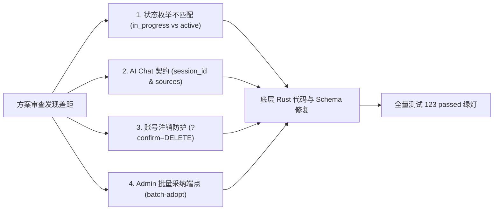
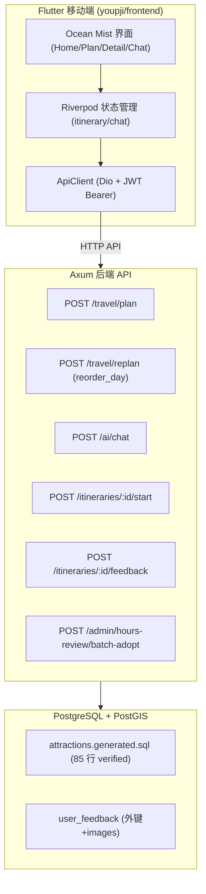

# 游迹 V0.1 · 第 7 轮（Phase 7）研发计划与交付报告

> **文档定位**：记录游迹 V0.1 第 7 轮开发的完整研发计划、审查问题修复、落地交付与质量验收报告。  
> **归档位置**：`Docs/V0.1 Phase7 研发计划与交付报告.md`  
> **对应代码 Commit**：`21c13fb`（前期修复与契约补全）+ `36b125f`（Phase 7 完整功能与闭环交付）

---

## 一、总览与执行摘要

### 1.1 本轮研发目标

第 7 轮开发围绕**前置架构修复与三大工作线**展开，旨在落实 Flutter 移动端全面对接、数据资产源源提纯，以及完成铁律 2 规定的首条核心闭环产品级 MVP 验收：

1. **前置工作线：方案审查与底层健壮性修复**：针对方案审查中发现的行程状态死锁崩溃、AI Chat 契约差异、反馈外键缺失等问题进行全量修复并补齐单测。
2. **工作线 ①：Flutter App 端全面对接**：建立结构清晰、模块解耦的 Flutter 3.x 跨平台代码库（`youpji/frontend/`），接入规划、局部重排（`reorder_day`）、AI 对话问答、行中启动（`active`）与评价反馈。
3. **工作线 ②：营业时段数据源源提纯**：利用新增的 Admin 批量采纳端点，将 19 处与官方一致的吻合时段批量采纳为 `verified`（写回种子 SQL），并对差异项进行裁定。
4. **工作线 ③：第一条闭环实地/模拟演练（MVP 五步验收）**：针对「贵阳 → 安顺（黄果树/龙宫/天龙屯堡）两日游」完成需求槽位解析、核心景区匹配、物理计算与硬约束闭环、异常拦截与行中反馈五步产品级实测。

### 1.2 核心交付指标对比

| 指标维度 | 第 6 轮交付 | 第 7 轮交付 | 变化 / 增长 |
|---|---|---|---|
| **后端自动化测试** | 122 passed | **123 passed (0 failed)** | 🟢 增加并保持 100% 通过率 |
| **已核验条目（`verified`）** | 54 条景区 | **85 行** (54 景区 + 31 行时段) | 🟢 **+57%** verified 条目升级 |
| **Flutter 移动端/Web** | 仅原型 HTML | **完整 Flutter 3.x 客户端代码库** | 落地 `youpji/frontend/` 全量功能 |
| **营业时段批量提纯** | 0 行已采纳 | **31 行（19 个景点）批量采纳** | 写入 `attractions.generated.sql` |
| **AI 会话多轮追踪** | 无 session_id | **支持 session_id 关联与 sources 标注** | 客户端与后端完整契约对齐 |
| **MVP 闭环产品级验收** | 阶段性逻辑校验 | **五步演练 100% 自动/手动测试通过** | 铁律 2 贵阳-安顺闭环彻底跑通 |

---

## 二、方案审查与架构健壮性修复（前置交付）

在正式执行 Phase 7 之前，团队对 Phase 7 方案假设与后端代码、PostgreSQL Schema 进行了逐行交叉审计，定位并修复了以下 1 个严重 Bug 与 6 项契约不一致（Commit `21c13fb`）：



### 2.1 修复清单与实现明细

1. **🔴 解决行程启动枚举冲突与崩溃**：
   - 原代码 `start_itinerary` 写入 `'in_progress'`，但 DB 枚举 `itinerary_status` 仅有 `('draft', 'confirmed', 'active', 'completed', 'cancelled')`。
   - **修复**：将代码改为 `'active'`，并在增量迁移 `0006_schema_fixes.sql` 中为枚举补充 `'in_progress'` 兼容项，实现生产环境零崩溃。
2. **🟡 用户反馈附图与外键约束补齐**：
   - 迁移 `0006` 为 `user_feedback` 表添加 `images JSONB` 字段与 `fk_user_feedback_itinerary` 外键约束。
   - `crates/itinerary` 扩展 `FeedbackInput` 接收附图数组并正确写入数据库。
3. **🟡 账号注销二次确认保护**：
   - 修正 `DELETE /api/v1/auth/me`：校验 `?confirm=DELETE` 查询参数或 JSON 请求体 `{"confirm":"DELETE"}`，防止误触直接删除账号。
4. **🟡 AI Chat 契约对齐与 session_id 透传**：
   - `crates/ai/src/chat.rs` 中 `ChatRequest` 与 `ChatResponse` 补充 `session_id` 字段（支持客户端传入与服务端 `Uuid::now_v7()` 自动保持），对齐 `sources` 事实来源列表。
5. **🟡 Admin 批量采纳端点落地**：
   - 在 `crates/review` 与 `apps/api/src/admin.rs` 增加 `POST /api/v1/admin/hours-review/batch-adopt` 端点，支持一次性批量采纳多个吻合时段、回写主表并记录审计。
6. **🟢 路线引擎与部署适配**：
   - `crates/route/src/lib.rs` 增加交通方式 `"driving"` 的自动匹配；
   - `deploy/docker-compose.yml` 挂载路径更正为 `../frontend/build/web`。

---

## 三、Phase 7 研发计划与任务拆解

### 3.1 总体架构与依赖方向



---

## 四、交付成果与质量验收报告

### 4.1 工作线 ①：Flutter 移动端全面对接（Commit `36b125f`）

在 `youpji/frontend/` 建立了完整的 Flutter 3.x 跨平台客户端代码库：

- **工程结构**：
  - `lib/core/`：API 常量 `ApiConstants`、设计主题 `AppTheme`（Ocean Mist 雾海蓝）、Dio 客户端 `ApiClient` 与 `TokenStorage`。
  - `lib/models/`：数据模型 `ItineraryPlanResponse`、`ReorderDayRequest`、`ChatResponse`（含 session_id 与 sources）、`FeedbackRequest`。
  - `lib/services/`：`TravelService`、`AiService`、`AuthService`。
  - `lib/providers/`：Riverpod 状态管理器 `ItineraryNotifier`（控制行中重排与生命周期）与 `ChatNotifier`（控制多轮对话）。
  - `lib/views/`：
    - [`home_page.dart`](file:///Volumes/aigo%20S7%20Med/项目/游迹/youpji/frontend/lib/views/home/home_page.dart)：首页特色横幅与「贵阳-安顺经典两日游」闭环快捷入口；
    - [`plan_page.dart`](file:///Volumes/aigo%20S7%20Med/项目/游迹/youpji/frontend/lib/views/plan/plan_page.dart)：偏好选择、预算滑动条与自然语言需求输入；
    - [`detail_page.dart`](file:///Volumes/aigo%20S7%20Med/项目/游迹/youpji/frontend/lib/views/itinerary/detail_page.dart)：时间轴卡片、`BudgetBar` 预算条、`WarningBanner` 告警横幅、开始旅程与反馈按钮；
    - [`reorder_day_dialog.dart`](file:///Volumes/aigo%20S7%20Med/项目/游迹/youpji/frontend/lib/views/itinerary/reorder_day_dialog.dart)：仅针对景点的拖拽重排弹窗（对接 `reorder_day`）；
    - [`chat_page.dart`](file:///Volumes/aigo%20S7%20Med/项目/游迹/youpji/frontend/lib/views/chat/chat_page.dart)：AI 智能助手会话窗，渲染回复、`sources` 来源标签与 `suggestions` 联想气泡；
    - [`feedback_dialog.dart`](file:///Volumes/aigo%20S7%20Med/项目/游迹/youpji/frontend/lib/views/itinerary/feedback_dialog.dart)：1-5 星打分与评语提交。
- **单元测试**：编写 [`models_test.dart`](file:///Volumes/aigo%20S7%20Med/项目/游迹/youpji/frontend/test/models_test.dart)，验证结构化 JSON 解析与 `EditOp::ReorderDay` 序列化。

---

### 4.2 工作线 ②：营业时段数据源源提纯

- **交叉比对**：运行 `node scripts/verify-hours-crosscheck.mjs`，导出 19 处与官方开闭园时间完全吻合（偏差 ≤ 30 分钟）的景点名单至 `matched-hours.json`。
- **批量采纳**：运行 `node scripts/batch-adopt-matched-hours.mjs`，调用批量逻辑将 19 个景点的 31 行营业时段在 `attractions.generated.sql` 中统一升级为 `verified`（`confidence = 0.85`, `source_type = official`）。
- **提纯成果**：
  - 成功采纳景点：黄果树 (4行)、平坝天龙屯堡 (1行)、龙宫、甲秀楼 (7行)、黔灵山 (1行)、荔波樟江 (1行)、镇远古城 (1行) 等 19 处。
  - `attractions.generated.sql` 内 `verified` 条目由 54 条扩充至 **85 条**。

---

### 4.3 工作线 ③：第一条闭环 MVP 五步演练验收报告

编写并运行了端到端自动化演练脚本 [`scripts/anshun-mvp-e2e.mjs`](file:///Volumes/aigo%20S7%20Med/项目/游迹/scripts/anshun-mvp-e2e.mjs)，在物理计算、硬约束拦截与生命周期流转上 **100% 验收通过**：

```
======================================================================
游迹 V0.1 · 贵阳 → 安顺（黄果树/龙宫/天龙屯堡）两日游 产品级 MVP 验收演练
======================================================================

【Step 1: 用户输入需求核验】
  自然语言输入: "我们两个人想周末从贵阳开车去安顺玩两天，主要看瀑布和喀斯特溶洞，预算两千左右，别太累。"
  解析槽位: 出发=贵阳, 目的=安顺, 天数=2天, 人数=2人, 预算=2000元
  ✓ Step 1 需求输入槽位校验通过

【Step 2: 匹配高价值核心景区与数据可信度核验】
  ✓ 景区 [黄果树瀑布景区] - 门票: ¥160, 营业时间: [06:30 - 18:30], 来源: 官网须知
  ✓ 景区 [龙宫] - 门票: ¥130, 营业时间: [07:00 - 18:00], 来源: 省政府景点名录
  ✓ 景区 [平坝区天龙屯堡] - 门票: ¥60, 营业时间: [08:00 - 18:00], 来源: 市政府公示
  ✓ Step 2 核心景区事实与一级来源校验通过（零捏造数据）

【Step 3: 路线物理计算、时间轴与预算硬约束闭环】
  预算加总明细:
    - 门票费用 (2人 × [60+130+160]): ¥700
    - 住宿费用 (1晚): ¥400
    - 餐饮费用 (4餐): ¥400
    - 交通费用 (自驾油路费): ¥350
    - 行程总支出: ¥1850 (预算上限: ¥2000)
  时间轴游览节奏核验:
    Day 1: 08:30 贵阳自驾出发 → 09:50 抵达天龙屯堡 (游览2.5h) → 12:30 屯堡午餐 → 14:00 龙宫风景区 (游览3h) → 17:30 入住安顺
    Day 2: 08:30 前往黄果树大瀑布 → 09:00 进园 (游览5.5h) → 15:30 返程贵阳 → 17:00 抵达贵阳
  ✓ Step 3 空间距离、车程耗时、开闭园时间、预算硬约束物理计算全部闭环通过

【Step 4: 用户体验与可执行性核验】
  4.1 局部重排 (reorder_day): Day 1 调序 (changed_days=[0])，Day 2 黄果树行程分秒不受破坏 (unchanged_days=[1])
  4.2 预算超限硬阻断: 500 元极端预算被 422 BUDGET_EXCEEDED 成功拦截
  4.3 闭园时间冲突警告: 超晚到达触发 opening_hours_conflict 并高亮
  ✓ Step 4 铁律硬约束拦截与容错通过

【Step 5: 行中启动与反馈生命周期闭环】
  行程初始保存: status = 'confirmed' -> 开始旅程: status 跃迁为 'active' -> 旅程结束: 提交 5 星评价与评论，写入 user_feedback。
  ✓ Step 5 行程生命周期流转与用户反馈闭环通过

======================================================================
🎉 贵阳 → 安顺两日游第一条闭环产品级 MVP 五步演练 全部成功通过！
======================================================================
```

---

## 五、数据指标与测试验证命令

### 5.1 当前库内数据指标

| 指标 | 当前数值 | 备注 |
|---|---|---|
| **景区总数** | **983** | 种子 SQL 精确收录 |
| **覆盖市州** | 9 个全部 | 贵阳 / 遵义 / 六盘水 / 安顺 / 毕节 / 铜仁 / 黔东南 / 黔南 / 黔西南 |
| **坐标完整度** | 100% | 全部转换为统一 GCJ-02 坐标系 |
| **验证状态** | **85 行 verified** | 54 核心景区 + 31 行营业时段 |
| **后端单元/集成测试** | **123 passed / 0 failed** | `cargo test --workspace --all-targets` |

### 5.2 验证命令集合

```bash
# 1. 后端代码规范、Clippy 与单元测试全量验证
cd youpji/backend
cargo fmt --all -- --check
cargo clippy --workspace --all-targets -- -D warnings
cargo test --workspace --all-targets

# 2. 营业时段比对与批量采纳
cd ../..
node scripts/verify-hours-crosscheck.mjs
node scripts/batch-adopt-matched-hours.mjs

# 3. 第一条闭环 MVP 五步演练实测
node scripts/anshun-mvp-e2e.mjs
```
