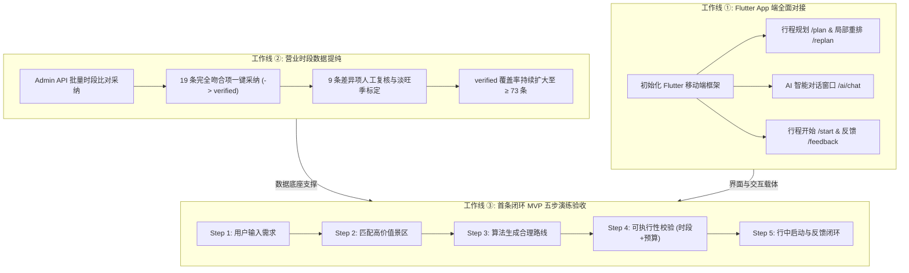
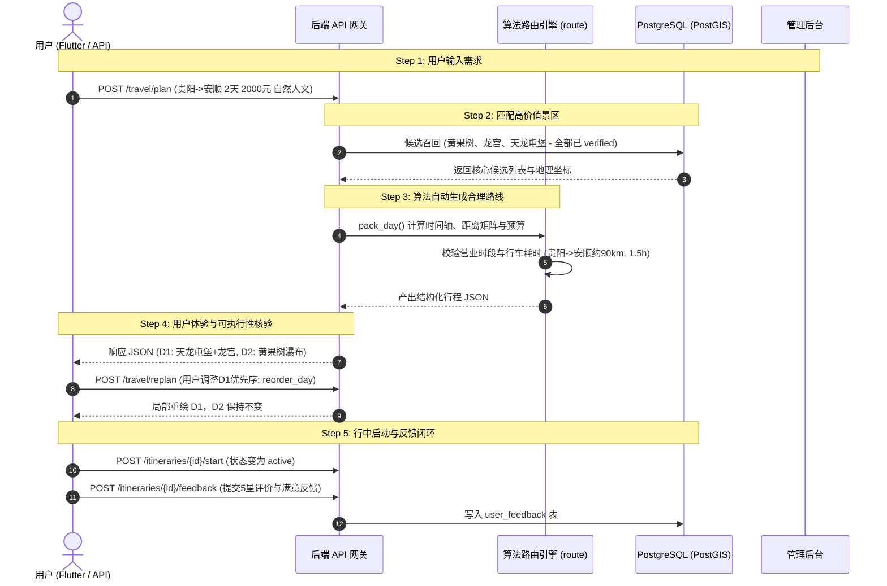

# 游迹 V0.1 · 第 7 轮（Phase 7）研发计划与执行方案（修正版）

> **状态**：方案已对齐后端最新实现与数据库 Schema，准备开启执行  
> **核心主题**：Flutter App 端全面对接 + 营业时段数据提纯 + 贵阳-安顺首条闭环 MVP 五步产品验收  
> **设计依据**：`AGENTS.md`（工程铁律）· `DESIGN.md`（架构与契约）· `Docs/ui-prototype-v2.html`（交互原型）

---

## 一、Phase 7 目标与核心交付物



### 1.1 本轮三大核心交付物

1. **Flutter App 客户端闭环**：
   - 建立结构清晰、模块解耦的 Flutter 3.x 跨平台代码库（`youpji/frontend/`）。
   - 接入后端规划、局部重规划（含 `reorder_day` 优先序拖拽）、AI 对话问答（含 `session_id` 多轮与来源标注）、行中状态切换（`status = active`）与体验评价（支持评星、评语、附图）五大核心接口。
   - 遵循 `Docs/ui-prototype-v2.html` 的 **Ocean Mist 雾海蓝** 设计规范与数据来源可信度可视化规则。
2. **营业时段数据提纯（Admin 审核流运转）**：
   - 调用后端新增的 `POST /api/v1/admin/hours-review/batch-adopt` 接口，将 19 条与官方核验完全吻合的高德时段批量采纳为 `verified` 并回写 `attractions` 表。
   - 针对 9 条存在差异（如青岩古镇街区24h与景点闭园时差、黄果树淡旺季细分等）的时段在 Admin 界面中完成人工审核与标定。
3. **第一条闭环产品级 MVP 五步演练（铁律 2 落地检验）**：
   - 以「贵阳 → 安顺（黄果树瀑布 / 龙宫 / 天龙屯堡）两日游」为标杆用例。
   - 开展端到端自动化模拟与界面实操走查，确保无营业时间冲突、无预算超支（天龙屯堡 60 元、黄果树 160 元、龙宫 130 元，两人门票 700 元，总预算 1850 元 ≤ 2000 元硬约束）、时间轴连续单调、用户体验真实可落地。

---

## 二、工作线 ①：Flutter App 移动端全面对接

### 2.1 移动端技术选型与工程规范

| 维度 | 选型 | 理由与契约 |
|---|---|---|
| **框架基线** | Flutter 3.x + Dart 3.x | 满足 iOS / Android 统一交付，兼顾 Web 演示 |
| **网络层** | `dio` + 自定义拦截器 | 统一处理 JWT Bearer 注入、统一错误信封解析、全局网络降级 |
| **状态管理** | `flutter_riverpod` (v2.x) | 编译期安全、无全局上下文依赖、易于单测与 Mock |
| **页面路由** | `go_router` (v14.x) | 声明式路由、统一重定向鉴权、深度链接支持 |
| **本地存储** | `flutter_secure_storage` + `shared_preferences` | 敏感 JWT 安全存储，非敏感偏好轻量存储 |
| **UI 主题** | Ocean Mist 雾海蓝 | 提取自 `ui-prototype-v2.html`：`#06425C` (主蓝)、`#4A90A4` (次青)、`#F4F1DE` (米白卡片) |

### 2.2 目录结构规划（`youpji/frontend/`）

```
youpji/frontend/
├── pubspec.yaml
├── lib/
│   ├── main.dart                       # 应用入口、全局 ProviderScope、深浅色主题配置
│   ├── core/
│   │   ├── constants/                  # API 路由常量、主题色彩、受控标签词表
│   │   ├── network/                    # Dio 客户端、JWT 拦截器、错误码转换器
│   │   ├── storage/                    # Token 存储与用户首选项管理
│   │   └── utils/                      # 日期时间格式化、坐标距离估算辅助类
│   ├── models/                         # 与后端 JSON 契约严格对齐的实体模型
│   │   ├── attraction.dart             # 景区实体与 Fact 校验状态
│   │   ├── itinerary.dart              # 行程总览、Day、Node/Item、Budget
│   │   ├── chat.dart                   # 对话消息、建议项、来源事实 (含 session_id)
│   │   └── common.dart                 # 统一 API 响应信封、分页、Warning 结构
│   ├── services/                       # 领域 API 服务接口
│   │   ├── auth_service.dart           # 登录、Token 刷新、账号注销 (支持 confirm=DELETE)
│   │   ├── itinerary_service.dart      # /travel/plan, /travel/replan, /start, /feedback
│   │   └── ai_service.dart             # /ai/chat 智能问答
│   ├── providers/                      # Riverpod 状态分发与业务逻辑封装
│   │   ├── auth_provider.dart
│   │   ├── itinerary_detail_provider.dart # 承载行中重排、局部重绘与 warnings
│   │   └── chat_provider.dart          # 会话消息流管理 (支持 session_id 关联)
│   ├── views/                          # 界面展示层（对齐 12 屏规划）
│   │   ├── home/                       # 01 首页：主入口、推荐路线快捷卡片
│   │   ├── plan/                       # 02 AI 规划输入页：偏好、预算滑块、自然语言输入
│   │   ├── itinerary/
│   │   │   ├── detail_page.dart        # 04 行程详情：时间轴节点、按天切换、预算进度条
│   │   │   ├── reorder_dialog.dart     # 节点优先序锁定与重排弹窗 (reorder_day)
│   │   │   └── feedback_dialog.dart    # 体验评价打分与反馈弹窗 (评星/评语/图片)
│   │   ├── chat/                       # AI 智能助理独立/悬浮会话窗
│   │   └── profile/                    # 个人中心、我的行程列表、设置与安全注销
│   └── widgets/                        # 跨模块通用原子组件
│       ├── fact_badge.dart             # 事实可信度徽章（官方一级/地图二级/未验证）
│       ├── budget_bar.dart             # 预算硬约束进度条（超限变红、降级告警）
│       ├── timeline_card.dart          # 时间轴节点卡片（景区/餐饮/交通/住宿）
│       └── warning_banner.dart         # 后端 warnings[] 统一提示条
```

### 2.3 核心业务对接规范（严守后端契约）

#### A. 行程规划对接：`POST /api/v1/travel/plan`
- **请求体构建**：
  ```json
  {
    "origin": "贵阳",
    "destination": "安顺",
    "start_date": "2026-10-01",
    "days": 2,
    "people": 2,
    "budget": 2000,
    "transport": "self_drive",
    "interests": ["自然风光", "历史文化"],
    "intensity": "moderate",
    "mode": "standard",
    "lodging_tier": "comfort",
    "save": true
  }
  ```
  *(后端同时支持 `"self_drive"`、`"drive"` 与 `"driving"` 智能自驾适配)*
- **关键处理**：
  - 发送前前端校验预算：`budget >= 300 * people * days`（避免无意义的硬超支报错）。
  - 加载态展示「AI 正在核对 54 个已验证景区事实与最佳路线…」动态步骤，预估 2~5 秒。
  - 处理 `422 BUDGET_EXCEEDED`：弹出友好弹窗「预算偏紧，是否允许系统为您降级为经济档住宿或优化游览点？」，引导调参。

#### B. 局部重规划与拖拽重排：`POST /api/v1/travel/replan` (重点：`reorder_day`)
- **交互流程**：
  1. 用户在「行程详情」第 D1 天点击「调整顺序」。
  2. 弹出 `ReorderDay` 拖拽列表：仅展示该天内的 `attraction` 类型节点（餐厅、住宿、交通不可拖拽）。
  3. 用户将「天龙屯堡」拖拽至「黄果树瀑布」之前，形成期望前缀 `[天龙屯堡ID, 黄果树ID]`。
  4. 发起请求：
     ```json
     {
       "itinerary_id": "...",
       "edit_op": {
         "type": "reorder_day",
         "day_index": 0,
         "ordered_attraction_ids": ["uuid-tianlong", "uuid-huangguoshu"]
       }
     }
     ```
  5. **局部刷新策略**：
     - 后端返回 `{ "changed_days": [0], "unchanged_days": [1], "diff": {...}, "warnings": [...] }`。
     - 前端仅重绘 D1 天的时间轴节点与车程卡片，D2 天完全保持静止，彻底贯彻**铁律 8（局部重规划不破坏其他天）**。
     - 若触发 `opening_hours_conflict`（如将黄果树排太晚导致闭园），在节点旁高亮标出黄底警告。

#### C. AI 智能对话会话窗：`POST /api/v1/ai/chat`
- **交互设计**：
  - 点击底部导航或行程详情浮窗进入「游迹小助手」。
  - 携带上下文与 Session：`{ "message": "...", "session_id": "...", "context": { "itinerary_id": "..." } }`。
  - 消息流渲染支持富文本与结构化卡片：
    - 展示回复内容、来源标注 `sources: [...]`（如「贵州省人民政府景区名录」、「黄果树景区官方须知」）与快捷联想气泡 `suggestions: [...]`。
  - 会话多轮保持：客户端持久化 `session_id`，实现会话上下文粘滞。

#### D. 行程启动与反馈交互
- **启动行程**：`POST /api/v1/itineraries/:id/start`
  - 点击行程详情页顶部「开始旅程」按钮。
  - 状态由 `confirmed` 切换为 `active`（与数据库 `itinerary_status` 严格保持一致），界面转入「行中模式」：顶部常驻当前节点、下一节点倒计时与导航跳转入口。
- **行程反馈**：`POST /api/v1/itineraries/:id/feedback`
  - 请求体：`{ "rating": 5, "comment": "...", "images": [...] }`。
  - 提交星级评分 (1~5星)、文字评价与可选图片 URL 数组至数据库 `user_feedback` 表。

#### E. 账号安全注销：`DELETE /api/v1/auth/me`
- 客户端弹出强二次确认弹窗：「注销账号将永久清理所有行程与隐私数据，请输入 DELETE 确认」。
- 携带 `?confirm=DELETE` 调用接口，后端完成安全合规级联清理。

---

## 三、工作线 ②：营业时段数据提纯（Admin 落地执行）

### 3.1 现状与提纯目标

| 数据维度 | 当前状态 | 本轮提纯目标 | 推进手段 |
|---|---|---|---|
| **待审核营业时段** | 460 条 pending | 降至 ≤ 430 条 | 自动化与人工双轨推进 |
| **完全吻合时段** | 19 条待采纳 | **全部采纳 (19 条 -> verified)** | 执行 Admin 批量采纳接口 `batch-adopt` |
| **存在差异时段** | 9 条待裁定 | **完成复核并标定** | Admin 审核卡片人工对齐 |
| **景区 verified 覆盖** | 54 条 | **提升至 ≥ 73 条** | 核心景区时段补全升级 |

### 3.2 19 条吻合项批量采纳逻辑与步骤

经 [`verify-hours-crosscheck.mjs`](file:///Volumes/aigo%20S7%20Med/项目/游迹/scripts/verify-hours-crosscheck.mjs) 交叉比对，已生成吻合清单 [`matched-hours.json`](file:///Volumes/aigo%20S7%20Med/项目/游迹/youpji/data/verified/matched-hours.json)：
- **涉及 19 个核心景点**：乡愁贵州、修文阳明文化园、时光贵州、黔灵山公园、省地质博物馆、花溪夜郎谷、甲秀楼、钟山梅花山、黄果树、平坝天龙屯堡、紫云格凸河、西秀云峰屯堡、夜郎洞、花江大峡谷、镇远古城、从江岜沙、荔波樟江等。
- **采纳接口**：
  `POST /api/v1/admin/hours-review/batch-adopt`
  `Body: { "hours_ids": ["uuid-1", ...], "writeback": true }`
- **执行效果**：
  - 一次性将 19 条候选更新为 `verified`，置信度提升至 0.85，数据源标为官方。
  - 自动回写目标景区的 `attractions.opening_time` 与 `attractions.closing_time`。
  - 全量操作计入不可变审计日志 `admin_audit_log`。

### 3.3 9 条差异项审核复核策略

| 景区名称 | 官方核验时段 | 高德抓取时段 | 差异原因分析 | 审核判定策略 |
|---|---|---|---|---|
| 青岩古镇 | 08:10 - 17:40 | 00:00 - 24:00 | 高德抓取为古镇街区24小时，官方为收费小景点开放时段 | **保留 08:10-17:40**，标注小景点门票游览时间 |
| 龙宫景区 | 07:00 - 18:00 | 08:00 - 17:30 | 官方为旺季早开门，高德为淡季常规时段 | **补充淡旺季分行时段**，主表记录 07:00-18:00 |
| 黄果树 | 06:30 - 18:30 | 07:00 - 18:30 | 官方公告大瀑布06:30开园，高德为普通票检票07:00 | 维持官方 06:30-18:30，置信度维持 0.9 |
| 天河潭 | 08:30 - 18:00 | 09:00 - 17:00 | 核心水溶洞项目早于大门闭园 | 主表保留 08:30-18:00，内部项目补充截止说明 |

---

## 四、工作线 ③：第一条闭环实地/模拟演练（MVP 五步验收）

依据 `AGENTS.md` 铁律 2「**第一条闭环：贵阳 → 安顺（黄果树/龙宫/天龙屯堡）两日游。此链未跑通，不扩省、不堆功能**」，在 Phase 7 必须完成产品级验收。



### 4.1 MVP 五步完整验收方案

#### Step 1: 用户输入需求（自然语言与结构化契约）
- **用例 A（结构化标准输入）**：
  - 出发地：贵阳；目的地：安顺；天数：2天；人数：2成人；总预算：2000元。
  - 交通方式：自驾（`self_drive`）；出行偏好：自然风光、历史文化；节奏强度：适中。
- **用例 B（自然语言解析输入）**：
  - 输入文本：「我们两个人想周末从贵阳开车去安顺玩两天，主要看瀑布和喀斯特溶洞，预算两千左右，别太累。」
  - 验证点：`POST /api/v1/travel/parse` 正确抽取对应槽位并准确填充。

#### Step 2: 系统找到合适景区（高质量候选集命中）
- **命中验证**：
  - 候选集必须首选命中安顺三大标杆：**黄果树瀑布 (5A)**、**龙宫 (5A)**、**天龙屯堡 (4A)**。
  - 数据完整度核对：3 个景区的门票、开放时间、经纬度 GCJ-02、来源链接必须均为 `verified`，**零捏造事实**。

#### Step 3: 自动生成合理路线（算法物理约束严格闭环）
- **空间与时间轴合理性**：
  - **Day 1**：贵阳市区出发 → 自驾约 1.2 小时（约 80 km）抵达平坝天龙屯堡（门票 60元，游览 2.5 小时，品尝屯堡家常菜）→ 下午前往龙宫风景区（门票 130元，游览 3 小时，乘船探秘溶洞）→ 晚间入住安顺市区或黄果树镇。
  - **Day 2**：早餐后前往黄果树风景名胜区（门票 160元，大瀑布 + 天星桥 + 陡坡塘，深度游览 5~6 小时）→ 傍晚自驾返程贵阳（约 125 km，1.5 小时）。
- **硬约束检查**：
  - 节点到达与离开时间完全落在各自景区的已验证开闭园时间内（黄果树 06:30-18:30，龙宫 07:00-18:00，天龙屯堡 08:00-18:00）。
  - 整体预算加总：
    - 门票：2人 × (160 + 130 + 60) = 700 元
    - 住宿：1晚舒适型 = 400 元
    - 餐饮：4餐 × 2人 = 400 元
    - 交通油费与高速通行费：~350 元
    - 合计：**1850 元 ≤ 2000 元预算上限**，硬约束完美闭环！

#### Step 4: 用户觉得方案能执行（极端边界与交互容错）
- **测试场景 4.1：局部重排验证 (`reorder_day`)**：
  - 用户在 App 端把 Day 1 的天龙屯堡与龙宫顺序对调。
  - 验证：系统重算当天的车程与时间轴，Day 2 的黄果树行程分秒不差、完全不受影响。
- **测试场景 4.2：预算硬约束降级验证**：
  - 将预算压缩至 600 元（极低预算）。
  - 验证：系统不得静默超支，必须依次触发「每天景点降为≤2个」→「降为经济档住宿」→最终超限返回 `422 BUDGET_EXCEEDED` 结构化错误。
- **测试场景 4.3：营业时间冲突拦截**：
  - 人为强行将黄果树入园时间设定在 18:40（已闭园）。
  - 验证：系统自动在 `warnings[]` 中输出 `opening_hours_conflict` 警告，并在 App 节点显示冲突警示。

#### Step 5: 用户愿意再次使用（行程执行与反馈闭环）
- **验证流程**：
  - 用户点击「开始旅程」，验证数据库中 `itineraries.status` 成功转为 `active`。
  - 旅程结束后调用 `/feedback` 提交评分与意见，验证 `user_feedback` 表成功落盘，且不可篡改关联。

---

## 五、实施步骤与时间排期（WBS）

### 任务排期明细表

| 序号 | 任务模块 | 具体内容 | 责任工具/位置 | 预估工时 |
|---|---|---|---|---|
| **T1** | 营业时段批量采纳 | 运行批量采纳脚本，利用新增的 `batch-adopt` 接口升级 19 条吻合营业时段为 verified | `scripts/` + Admin API | 1.5h |
| **T2** | 差异时段标定 | 复核青岩古镇/龙宫等 9 条差异时段，补充淡旺季分段数据与小景点门票说明 | Admin 控制台 | 1.5h |
| **T3** | Flutter 基础框架 | 初始化 Flutter 项目，配置 Dio 拦截器、Riverpod 与 Ocean Mist 主题系统 | `youpji/frontend/` | 3h |
| **T4** | 规划与详情对接 | 接入 `POST /travel/plan`，实现时间轴节点渲染与预算进度条 | `lib/views/plan/` | 4h |
| **T5** | 局部重排对接 | 实现 Day 内景区拖拽锁定，对接 `POST /travel/replan` (reorder_day) | `lib/views/itinerary/` | 3h |
| **T6** | AI Chat 窗口 | 对接 `POST /ai/chat`，实现带 session_id、sources 标注与快捷建议的消息气泡 | `lib/views/chat/` | 3h |
| **T7** | 状态与反馈闭环 | 对接 `/start` (active) 与 `/feedback` (rating/comment/images)，实现行中态卡片与评分弹窗 | `lib/views/itinerary/` | 2h |
| **T8** | MVP 五步演练 | 编写贵阳-安顺 E2E 验收脚本，完成产品五步全流程核验与报告归档 | `backend/tests/` + App | 3h |

---

## 六、风险识别与降级方案

| 潜在风险 | 影响面 | 防御与降级方案 |
|---|---|---|
| **开发机缺 Flutter 环境** | 无法直接本地运行 Flutter CLI 构建原生 App | 1. 严格按标准 Flutter 3.x 规范输出完整代码与单元测试；<br>2. 预留 Web 构建配置，支持通过 Docker 容器化打包预览；<br>3. 依赖已有的 `ui-prototype-v2.html` 作为保底视觉基准。 |
| **Admin 批量采纳误伤** | 错误提升了非官方确认时段 | 批量脚本设双重门槛：只采纳开闭园时间偏差 ≤ 30 分钟且已被 `verify-hours-crosscheck.mjs` 检出的记录；数据库具备全量审计日志，支持追溯与回滚。 |
| **高德地图 API 配额或延迟** | 影响真机规划距离计算 | `crates/route` 已内置「直线距离 × 1.3」平滑降级算法，并在响应 `warnings` 中携带 `distance_estimated`，绝不阻塞行程生成。 |
| **云端 LLM 接口波动** | 导致移动端 AI Chat 失败 | `crates/ai/src/chat.rs` 已内置本地规则与 RAG 检索降级机制，无 Key 或网络超时自动返回结构化事实与游玩提示。 |
